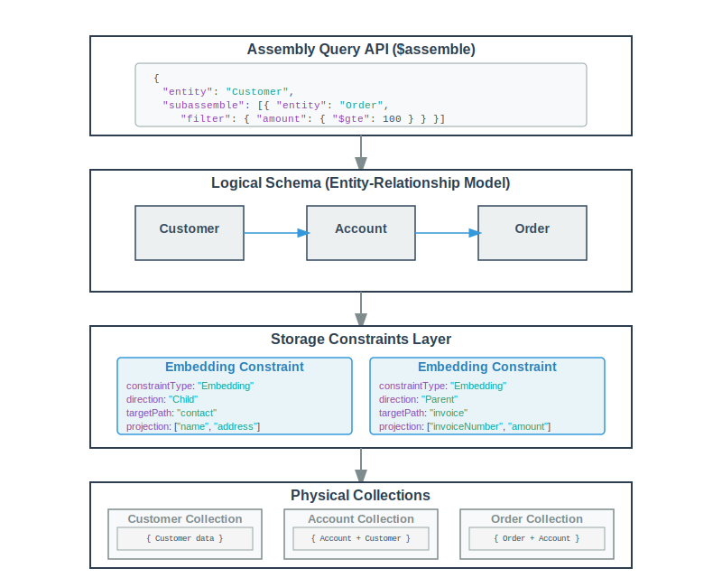

# Babelfish

A Rust-based tool for generating MongoDB aggregation pipelines that perform intelligent joins across entities based on defined relationships and storage constraints.

## Overview

The babelfish project introduces the $join pipeline stage to bridge the gap between normalized entity-relationship data models and MongoDB's document-oriented storage. It provides a declarative way to:

1. Define entity relationships and storage constraints in an ERD (Entity Relationship Diagram)
2. Generate physical MongoDB documents based on those constraints
3. Join logical views of data across entities using high-level syntax
4. Generate optimized MongoDB aggregation pipelines automatically

The tool automatically analyzes document structures and relationships to determine the most efficient way to retrieve data based on your queries.

## Key Concepts

### Storage Constraints as an Abstraction Layer

One of the key architectural features of the MongoDB Document Assembler is how it uses storage constraints to create an abstraction layer between the logical data model and the physical document storage:



This abstraction provides several benefits:

1. **Decoupling**: Join queries can be written against the logical schema without knowledge of physical storage
2. **Flexibility**: The physical storage structure can be changed by modifying storage constraints without impacting join queries
3. **Optimization**: The system automatically determines optimal collections to query based on storage constraints
4. **Evolution**: As your data model evolves, you can modify storage constraints to optimize for new access patterns while maintaining backward compatibility

### Schema Definition

The core of the system is the schema definition (new_schema.json), which contains:

- **Entities**: Represent business objects like Customer, Account, Order, Invoice, etc.
- **JSON Schema**: Defines the expected structure and validation rules for each entity
- **References**: Define relationships between entities
- **Storage Constraints**: Specify how data should be physically stored:
  - **Embedding**: Embed data from one entity into another
  - **Reference**: Store references to other documents
  - **Bucket**: Group child documents into buckets within a parent

The schema now uses MongoDB's JSON Schema format, providing better integration with MongoDB's validation capabilities.

# Note: The system now uses the $join operator with the ERD format specified in assets/new_erd.json.
The $join operator provides a more intuitive and powerful way to express multi-entity queries.

### Storage Constraint Types

The system supports three main types of storage constraints:

#### 1. Embedding Constraints

Embedding constraints specify how to embed data from one entity into another. They have a `direction` property:

- **Parent**: Child entity data is embedded in the parent entity
- **Child**: Parent entity data is embedded in the child entity

Example configuration:
```json
{
  "constraintType": "embedded",
  "consistency": "strong",
  "direction": "child",
  "targetPath": "contact",
  "projection": ["customerName", "customerAddress"]
}
```

Note that in the new schema format, constraint types are now lowercase ("embedded" instead of "Embedding").

#### 2. Reference Constraints

Reference constraints store just the ID or a reference value from one entity to another.

Example configuration:
```json
{
  "constraintType": "reference",
  "consistency": "strong",
  "direction": "child",
  "targetPath": "customerId",
  "extendedProperties": {
    "blueprint": "sourceId#ISOTIME"
  }
}
```

#### 3. Bucket Constraints

Bucket constraints allow grouping multiple child documents into arrays within a parent document, based on time or volume dimensions.

Example configuration:
```json
{
  "constraintType": "bucket",
  "consistency": "strong",
  "direction": "child",
  "targetPath": "events",
  "extendedProperties": {
    "dimension": "time",
    "size": 10
  }
}
```

### Join Configuration

The join configuration uses the `$join` operator within a MongoDB pipeline, defined as follows:

```json
{
  "$join": {
    "$inner": {
      "args": ["Customer", "Order", "OrderItem"],
      "condition": {"$gt": ["$Order.total_amount", 500]}
    }
  }
}
```

Key features of the join format:
- Uses `$join` within a standard MongoDB pipeline
- Supports inner and left join types with `$inner` and `$left`
- Traverses entity relationships defined in the ERD
- Filters use MongoDB's expression syntax
- Can be combined with other MongoDB pipeline stages like `$limit` and `$skip`

## Installation


### Running the Tool

The tool parses the specified $join config and generates the appropriate pipeline based on the ERD or validates the specified ERD file.

// to run $join pipeline generation and optimization

cargo run --bin babelfish-cli -- -p assets/join_test.json

// to parse an ERD

cargo run --bin babelfish-cli -- -e assets/new_erd.json

## Schema and Assembly Examples

### Schema Example (MongoDB JSON Schema Format)

```json
{
  "schemaName": "company_erd",
  "entities": {
    "Account": {
      "db": "company",
      "collection": "Account",
      "primaryKey": "_id",
      "jsonSchema": {
        "bsonType": "object",
        "properties": {
          "_id": { "bsonType": "objectId" },
          "accountId": { "bsonType": "string" },
          "accountName": { "bsonType": "string" },
          "customerId": { "bsonType": "objectId" }
        },
        "references": {
          "customerId": {
            "entity": "Customer",
            "field": "_id",
            "relationshipType": "many-one",
            "storageConstraints": [
              {
                "constraintType": "embedded",
                "consistency": "strong",
                "direction": "child",
                "targetPath": "contact",
                "projection": ["customerName", "customerAddress"]
              }
            ]
          }
        },
        "required": ["_id", "accountId", "accountName", "customerId"],
        "additionalProperties": false
      }
    },
    "Customer": {
      "db": "company",
      "collection": "Customer",
      "primaryKey": "_id",
      "jsonSchema": {
        "bsonType": "object",
        "properties": {
          "_id": { "bsonType": "objectId" },
          "customerName": { "bsonType": "string" },
          "customerAddress": { "bsonType": "string" }
        },
        "required": ["_id", "customerName", "customerAddress"],
        "additionalProperties": false
      }
    }
    // Other entities follow the same pattern...
  }
}
```

### Join Example

```json
[
  {
    "$join": {
      "$inner": {
        "args": ["Customer", "Order", "OrderItem"],
        "condition": {"$gt": ["$Order.total_amount", 500]}
      }
    }
  },
  { "$limit": 10 },
  { "$skip": 0 }
]
```

This example performs an inner join across three related entities (Customer → Order → OrderItem) with a condition filtering orders above $500.

## Advanced Features

### Simplified Inner Joins with $project and $filter

For simple inner join queries, you can use `$project` with `$$E` annotations instead of explicit `$join` operations. This provides a more concise syntax when you only need inner joins:

#### Using $$E Annotations

```json
[
    {"$project": {
        "Customer.last_name": "$$E",      // Project specific field from Customer entity
        "Order._id": "$$E",               // Project specific field from Order entity  
        "Order.total_amount": "$$E",      // Project another field from Order entity
        "OrderItem": "$$E*"               // Project all fields from OrderItem entity
    }},
    {"$match": {"$expr": {"$gte": ["$Order.total_amount", 40]}}},
    {"$sort": {"Order.total_amount": -1}},
    {"$limit": 10}
]
```

#### $$E Annotation Types

- **`$$E`**: Projects a specific field from an entity (e.g., `"Customer.name": "$$E"`)
- **`$$E*`**: Projects all fields from an entity (e.g., `"Customer": "$$E*"`)

The system automatically detects `$$E` annotations and generates the necessary inner join operations based on entity relationships defined in the ERD. This approach is ideal when:
- You only need inner joins (no left joins)
- The join conditions are based on standard entity relationships
- You want concise, declarative syntax

### Join Types

The `$join` operator supports multiple join types for more complex scenarios:

#### Inner Join
```json
{
  "$join": {
    "$inner": {
      "args": ["Customer", "Order"],
      "condition": {"$gte": ["$Order.amount", 100]}
    }
  }
}
```

#### Left Join
```json
{
  "$join": {
    "$left": {
      "args": ["Customer", "Order"],
      "condition": {"$gte": ["$Order.amount", 100]}
    }
  }
}
```

#### Simple Entity Reference
```json
{
  "$join": "Customer"
}
```

### ERD-Based Relationship Definition

Relationships between entities are defined in the ERD file (`assets/new_erd.json`):

```json
{
  "Customer": {
    "relationships": [
      {
        "foreignEntity": "Order",
        "relationshipType": "one-to-many",
        "constraint": {
          "constraintType": "foreign",
          "db": "ecommerce_db",
          "collection": "orders",
          "localKey": "_id",
          "foreignKey": "customer_ref_id"
        }
      }
    ]
  }
}
```

### Constraint Types

The system supports different constraint types for joining data:

#### Foreign Key Constraints
Use MongoDB `$lookup` operations to join across collections:
```json
{
  "constraintType": "foreign",
  "db": "ecommerce_db",
  "collection": "orders",
  "localKey": "_id",
  "foreignKey": "customer_ref_id"
}
```

#### Embedded Constraints
Use `$unwind` operations to flatten embedded arrays/objects:
```json
{
  "constraintType": "embedded",
  "targetPath": "contact"
}
```

### Complex Filtering Conditions

The join conditions support MongoDB's expression operators:

```json
"condition": {
  "$and": [
    {"$gte": ["$Order.amount", 100]},
    {"$lte": ["$Order.amount", 1000]},
    {"$eq": ["$Order.status", "completed"]}
  ]
}
```

### Integration with MongoDB Pipelines

The `$join` operator can be used as part of a larger MongoDB aggregation pipeline:

```json
[
  {"$match": {"customerStatus": "active"}},
  {
    "$join": {
      "$inner": {
        "args": ["Customer", "Order", "OrderItem"],
        "condition": {"$gt": ["$Order.total_amount", 500]}
      }
    }
  },
  {"$sort": {"Customer.customerName": 1}},
  {"$limit": 10}
]
```

This enables combining the join capabilities with MongoDB's rich aggregation framework.
