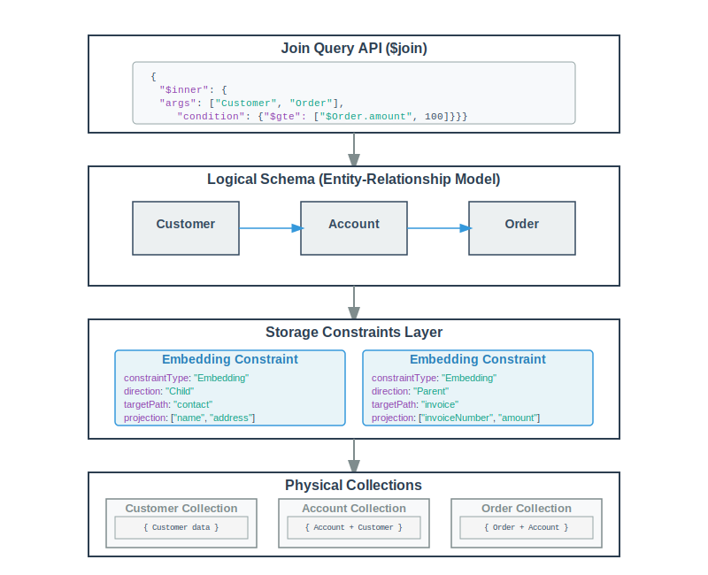

# Babelfish

A Rust-based tool for generating MongoDB aggregation pipelines that perform intelligent joins across entities based on defined relationships and storage constraints.

## Overview

Babelfish introduces two new stages to MongoDB aggregation: `$conjure` and `$join`. These stages abstract storage from the logical notion of entities in the database, allowing for queries that will continue to function as the storage model of the data evolves over time.

The babelfish project bridges the gap between normalized entity-relationship data models and MongoDB's document-oriented storage. It provides a declarative way to:

1. Define entity relationships and storage constraints in an ERD (Entity Relationship Diagram)
2. Generate physical MongoDB documents based on those constraints
3. Join logical views of data across entities using high-level syntax
4. Generate optimized MongoDB aggregation pipelines automatically

The tool automatically analyzes document structures and relationships to determine the most efficient way to retrieve data based on your queries.

## Key Concepts

### Storage Constraints as an Abstraction Layer

One of the key architectural features of the MongoDB Document Assembler is how it uses storage constraints to create an abstraction layer between the logical data model and the physical document storage:



This abstraction provides several benefits:

1. **Decoupling**: Join queries can be written against the logical schema without knowledge of physical storage
2. **Flexibility**: The physical storage structure can be changed by modifying storage constraints without impacting join queries
3. **Optimization**: The system automatically determines optimal collections to query based on storage constraints
4. **Evolution**: As your data model evolves, you can modify storage constraints to optimize for new access patterns while maintaining backward compatibility

### Schema Definition

The core of the system is the entity relationship definition (rel.json), which contains 
- **A mapping from Source Entity to Target Entity relationship with a storage constraint for that relationship
- **Storage Constraints**: Specify how data should be physically stored:
  - **Embedding**: Embed data from one entity into another
  - **Reference**: Store references to other documents
  - **Bucket**: Group child documents into buckets within a parent

### Storage Constraint Types

The system supports three main types of storage constraints:

#### 1. Embedding Constraints

Embedding constraints specify how to embed data from one entity into another. They have a `direction` property:

- **Parent**: Child entity data is embedded in the parent entity
- **Child**: Parent entity data is embedded in the child entity

Example configuration:
```json
{
  "constraintType": "embedded",
  "consistency": "strong",
  "direction": "child",
  "targetPath": "contact",
  "projection": ["customerName", "customerAddress"]
}
```

Note that in the new schema format, constraint types are now lowercase ("embedded" instead of "Embedding").

#### 2. Reference Constraints

Reference constraints store just the ID or a reference value from one entity to another.

Example configuration:
```json
{
  "constraintType": "reference",
  "consistency": "strong",
  "direction": "child",
  "localKey": "customerId",
  "foreignKey": "_id",
  "extendedProperties": {
    "blueprint": "sourceId#ISOTIME"
  }
}
```

### Join Configuration

The join configuration uses the `$join` operator within a MongoDB pipeline, defined as follows:

```json
{
  "$join": {
    "$inner": {
      "args": ["Customer", "Order", "OrderItem"],
      "condition": {"$gt": ["$Order.total_amount", 500]}
    }
  }
}
```

Key features of the join format:
- Uses `$join` within a standard MongoDB pipeline
- Supports inner and left join types with `$inner` and `$left`
- Traverses entity relationships defined in the ERD
- Filters use MongoDB's expression syntax
- Can be combined with other MongoDB pipeline stages like `$limit` and `$skip`
- `$join` can also contain a `$derived` entity-named pipeline, this allows for generating entities
  on the fly without modifying the erd.

## Project Structure

Babelfish is a Rust workspace consisting of multiple crates:

- **`babelfish`**: Core library containing the pipeline rewriting logic
  - `conjure_rewrite`: Handles `$conjure` stage transformations
  - `join_rewrite`: Handles `$join` stage transformations
  - `match_movement_rewrite`: Optimizes `$match` stage placement
  - `erd` and `erd_graph`: Entity Relationship Diagram management
- **`babelfish-cli`**: Command-line interface for the tool
- **`ast`**: Abstract Syntax Tree definitions for MongoDB pipeline stages
- **`schema`**: Schema and ERD definitions
- **`mongosql-datastructures`**: Supporting data structures
- **`visitgen`**: Code generation for visitor pattern implementations
- **`visitgen-test`**: Tests for the visitor code generator

## Installation

<<<<<<< HEAD
### Prerequisites

- Rust toolchain (1.70 or higher)
- Cargo package manager

### Building from Source

```bash
# Clone the repository
git clone https://github.com/yourusername/babelfish.git
cd babelfish

# Build the project
cargo build --release

# Run the CLI tool
cargo run --bin babelfish-cli -- [OPTIONS]
```

### Running the Tool

The CLI tool supports several commands for different operations:

```bash
# Generate pipeline from join configuration
cargo run --bin babelfish-cli -- -p <pipeline_file>
# Example:
cargo run --bin babelfish-cli -- -p assets/join_test.json

# Parse and validate an ERD file (old format)
cargo run --bin babelfish-cli -- -e <erd_file>
# Example:
cargo run --bin babelfish-cli -- -e assets/erd.json

<<<<<<< HEAD
# Parse and validate a new format ERD file
cargo run --bin babelfish-cli -- -n <nerd_file>
# Example:
cargo run --bin babelfish-cli -- -n assets/new_erd.json

# Run match movement optimization
cargo run --bin babelfish-cli -- -m <match_move_file>
# Example:
cargo run --bin babelfish-cli -- -m assets/match_move.json
```

### Command Line Options

- `-p, --pipeline-file <FILE>`: Process a pipeline JSON file containing `$join` or `$conjure` stages
- `-e, --erd-file <FILE>`: Parse and validate an ERD file (old schema format)
- `-n, --nerd-file <FILE>`: Parse and validate a new ERD file (new schema format)
- `-m, --match-move <FILE>`: Apply match movement optimization to a pipeline

## Schema and Join Examples

```json
  "Order": {
       "OrderItem": {
            "relationshipType": "many-to-one",
            "description": "Order contains multiple order items, embedded within the order document using the canonical OrderItem structure.",
            "constraint": {
                 "collection": "order_items",
                 "db": "ecommerce_db",
                 "constraintType": "foreign",
                 "localKey": "_id",
                 "foreignKey": "order_ref_id",
                 "direction": "child",
                 "projection": [
                      "product_ref_id",
                      "product_name_snapshot",
                      "quantity",
                      "price_at_purchase",
                      "original_product_id"
                 ]
            },
            "consistency": "strong"
       },
       "ShippingAddress": {
            "relationshipType": "one-to-one",
            "description": "Order has a shipping address, embedded as a snapshot using the canonical Address structure.",
            "constraint": {
                 "constraintType": "embedded",
                 "direction": "child",
                 "targetPath": "shipping_address",
                 "projection": [
                      "street_address",
                      "city",
                      "state",
                      "postal_code",
                      "country"
                 ]
            },
            "consistency": "strong"
       },
       "BillingAddress": {  
            "relationshipType": "one-to-one",
            "description": "Order has a billing address, embedded as a snapshot using the canonical Address structure.",
            "constraint": {
                 "constraintType": "embedded",
                 "direction": "child",
                 "targetPath": "billing_address",
                 "projection": [
                      "street_address",
                      "city",
                      "state",
                      "postal_code",
                      "country"
                 ]
            },
            "consistency": "strong"
       }
   }
```

This shows the relationships from the Order entity to the OrderItems, ShippingAddress, and
BillingAddress entities.


### Join Example

```json
[
  {
    "$join": {
      "$inner": {
        "root": "Customer",
        "args": ["Order", "OrderItem"],
        "condition": {"$gt": ["$Order.total_amount", 500]}
      }
    }
  },
  { "$limit": 10 },
  { "$skip": 0 }
]
```

This example performs an inner join across three related entities (Customer → Order → OrderItem) with a condition filtering orders above $500.

### Advanced Join with Derived Entities

```json
[
  {
    "$join": {
      "$inner": {
        "root": "Customer",
        "args": [
          {
            "$derived": {
              "entity": "Order",
              "pipeline": [
                {
                  "$lookup": {
                    "from": "orders",
                    "localField": "customer_id",
                    "foreignField": "_id",
                    "as": "Customer.orders"
                  }
                }
              ]
            }
          },
          {
            "$left": {
              "args": ["OrderItem"]
            }
          }
        ],
        "condition": {"$gt": ["$Order.total_amount", 500]}
      }
    }
  },
  { "$limit": 10 },
  { "$skip": 0 }
]
```

This example shows how to use derived entities with custom pipelines and nested left joins.

## Advanced Features

### The $conjure Stage

The `$conjure` stage provides a simplified syntax for performing inner joins with field projections. It abstracts away the complexity of writing explicit join and projection stages.

#### Syntax

```json
{
  "$conjure": ["Entity1.field1", "Entity2.field2", "Entity3.*"]
}
```

#### Features

- **Specific Field Selection**: Use `"Entity.fieldName"` to select specific fields
- **Wildcard Selection**: Use `"Entity.*"` to select all fields from an entity
- **Automatic Join Generation**: The system automatically determines the join path based on entity relationships
- **Simplified Syntax**: Reduces boilerplate for common join patterns

#### Example

Instead of writing:
```json
[
  {
    "$join": {
      "$inner": {
        "args": ["Customer", "Order", "OrderItem"]
      }
    }
  },
  {
    "$project": {
      "Customer.customerName": 1,
      "Customer.customerAddress": 1,
      "OrderItem": 1
    }
  }
]
```

You can simply write:
```json
{
  "$conjure": ["Customer.customerName", "Customer.customerAddress", "OrderItem.*"]
}
```

The `$conjure` stage internally generates the appropriate `$join` and `$project` stages, making it ideal for straightforward inner join queries where you need specific fields from multiple entities.

### Match Movement Optimization

Babelfish includes a match movement optimizer that automatically repositions `$match` stages in the pipeline for better performance. The optimizer:

- Moves `$match` stages as early as possible in the pipeline
- Pushes filters down to reduce data processed by subsequent stages
- Maintains query semantics while improving execution efficiency

This optimization happens automatically when processing pipelines through the CLI tool.

### Simplified Inner Joins with $project and $filter

For simple inner join queries, you can use `$project` with `$$E` annotations instead of explicit `$join` operations. This provides a more concise syntax when you only need inner joins:

#### Using $$E Annotations

```json
[
    {"$project": {
        "Customer.last_name": "$$E",      // Project specific field from Customer entity
        "Order._id": "$$E",               // Project specific field from Order entity  
        "Order.total_amount": "$$E",      // Project another field from Order entity
        "OrderItem": "$$E*"               // Project all fields from OrderItem entity
    }},
    {"$match": {"$expr": {"$gte": ["$Order.total_amount", 40]}}},
    {"$sort": {"Order.total_amount": -1}},
    {"$limit": 10}
]
```

#### $$E Annotation Types

- **`$$E`**: Projects a specific field from an entity (e.g., `"Customer.name": "$$E"`)
- **`$$E*`**: Projects all fields from an entity (e.g., `"Customer": "$$E*"`)

The system automatically detects `$$E` annotations and generates the necessary inner join operations based on entity relationships defined in the ERD. This approach is ideal when:
- You only need inner joins (no left joins)
- The join conditions are based on standard entity relationships
- You want concise, declarative syntax

### Join Types

The `$join` operator supports multiple join types for more complex scenarios:

#### Inner Join
```json
{
  "$join": {
    "$inner": {
      "args": ["Customer", "Order"],
      "condition": {"$gte": ["$Order.amount", 100]}
    }
  }
}
```

#### Left Join
```json
{
  "$join": {
    "$left": {
      "args": ["Customer", "Order"],
      "condition": {"$gte": ["$Order.amount", 100]}
    }
  }
}
```

#### Simple Entity Reference
```json
{
  "$join": "Customer"
}
```

### Constraint Types

The system supports different constraint types for joining data:

#### Foreign Key Constraints
Use MongoDB `$lookup` operations to join across collections:
```json
{
  "constraintType": "foreign",
  "db": "ecommerce_db",
  "collection": "orders",
  "localKey": "_id",
  "foreignKey": "customer_ref_id"
}
```

#### Embedded Constraints
Use `$unwind` operations to flatten embedded arrays/objects:
```json
{
  "constraintType": "embedded",
  "targetPath": "contact"
}
```

### Complex Filtering Conditions

The join conditions support MongoDB's expression operators:

```json
"condition": {
  "$and": [
    {"$gte": ["$Order.amount", 100]},
    {"$lte": ["$Order.amount", 1000]},
    {"$eq": ["$Order.status", "completed"]}
  ]
}
```

### Integration with MongoDB Pipelines

The `$join` operator can be used as part of a larger MongoDB aggregation pipeline:

```json
[
  {"$match": {"customerStatus": "active"}},
  {
    "$join": {
      "$inner": {
        "args": ["Customer", "Order", "OrderItem"],
        "condition": {"$gt": ["$Order.total_amount", 500]}
      }
    }
  },
  {"$sort": {"Customer.customerName": 1}},
  {"$limit": 10}
]
```

This enables combining the join capabilities with MongoDB's rich aggregation framework.
## Key Implementation Details

### Error Handling

The codebase uses Rust's `Result` type with custom error enums for each module:
- `ConjureRewrite::Error`: Handles errors in `$conjure` stage processing
- `JoinRewrite::Error`: Handles errors in `$join` stage processing
- `CliError`: Wraps various error types for the CLI application

### Pipeline Processing Flow

1. **Input Parsing**: The CLI reads JSON pipeline files
2. **Conjure Rewriting**: `$conjure` stages are expanded into `$join` and `$project` stages
3. **Join Rewriting**: `$join` stages are transformed into MongoDB aggregation stages
4. **Match Movement**: `$match` stages are optimized for performance
5. **Output Generation**: The final MongoDB pipeline is output as JSON

### Relationship Definition

The system uses a relationships file (`assets/rel.json`) to define how entities relate to each other. This file specifies:
- Relationship types (one-to-many, many-to-one)
- Constraint types (foreign, embedded)
- Database and collection information
- Key mappings between entities
- Projections for embedded data

## Contributing

When contributing to Babelfish:

1. Ensure all Rust code follows standard formatting (`cargo fmt`)
2. Add tests for new functionality
3. Update documentation for API changes
4. Follow the existing error handling patterns
5. Maintain backward compatibility where possible

## License

[License information to be added]

## Acknowledgments

Babelfish leverages several key Rust libraries:
- `petgraph` for graph-based ERD processing
- `serde` for JSON serialization/deserialization
- `clap` for command-line parsing
- `thiserror` for error handling
